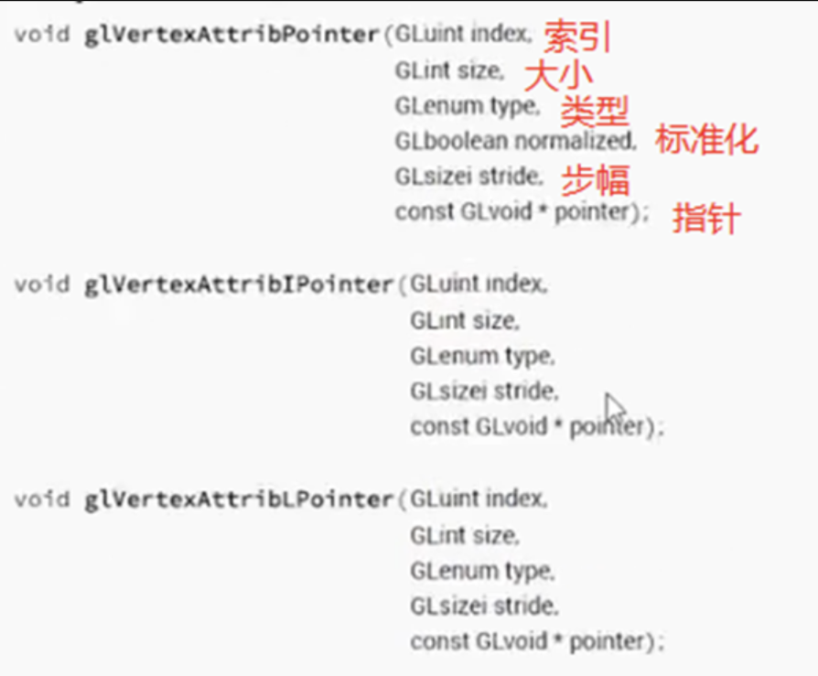
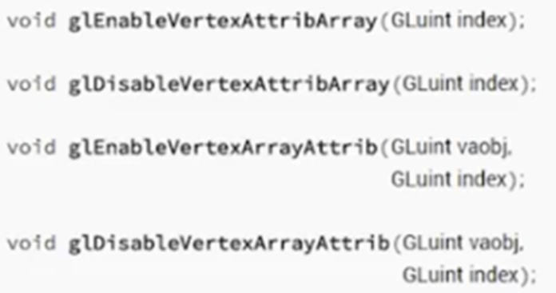

# OpenGL学习

#### OpenGL是什么

OpenGL的是一个图形API，API代表应用程序编程接口，它本质上是我们可以调用来执行特定任务的函数。在这种情况下，由于OpenGL是一个图形API，它允许我们进行图形处理，具体来说OpenGL允许我们来实际访问和控制我们的GPU。OpenGL是一个规范，而不是一种框架或代码，没有实际的源代码，真正的源代码由显卡驱动提供。OpenGL有一定跨平台能力。

#### 传统OpenGL和现代OpenGL

OpenGL于90年代发布，那时的GPU是不可编程的，不能随心所欲，尤其在使用这些底层的API时。但现在人们可以很大程度去控制它，制造商给了程序员和开发者更多的控制权，这显然很好，因为我们可以为它做更多的优化。现代的OpenGL更像一个循环，一个低级的法则，它能给你比之前更多的控制权。传统的OpenGL更像是一套程序。
所以比如要画一个三角形，并且想要添加光源，基本上就是让光源等于true，就可以激活OpenGL的光源，然后就再告诉OpenGL光源加在哪里就可以了。所以传统的OpenGL真的很像一套预设，很容易使用代码比较少。但这样就会造成不能给你太多的控制权。但其实我们是想要更多的控制权的。

**传统OpenGL和现代OpenGL之间最大的区别是可编程的着色器。** 着色器是程序，它是运行在GPU上的代码。当我们使用cpp或Java等语言写代码时，这些代码是运行在CPU上的，但当我们开始处理图形的大部分时间里，我们想要更为精确的控制显卡运行，我们可能要将大部分代码从CPU转到GPU上，因为它在GPU上运行更快，这就是着色器存在的意义，允许我们在GPU上运行代码。

#### OpenGL中的顶点缓冲区和绘制三角形 

要使用现代OpenGL绘制绘制一个三角形，需要完成几件事情。首先，我们需要创建一个顶点缓冲区（vertor buffer）。同时还需要创建一个着色器（shader）。

buffer就是一块用来存字节的内存，一个内存字节数组。顶点缓冲区跟C++中的字符数组的内存缓冲区不太一样，区别在于它是 OpenGL 中的内存缓冲区，这意味着它实际上在显卡上，在我们的VRAM（显存）中，也就是Video RAM。所以使用现代的OpenGL表示三角形的话，需要定义一些数据来表示三角形，然后把它们放到显卡（GPU）的 VRAM 中，还需要发出 DrawCall 指令（这是一个绘制指令），（意思就是告诉电脑，你的显存中有一堆数据，读取它，并把它绘制在屏幕上），实际上，我们还需要告诉显卡，如何读取和解释这些数据，以及如何把它实际显示到我们屏幕上。当我们在CPU这边做了所有事情（我们用C++写的东西都是在CPU上运行的）。当我们写完这些东西，还要用某种方式告诉显卡，一旦从CPU发出了DrawCall指令，且一旦从显卡读到了这些数据，我希望你在屏幕上给我绘制出三角形。因为我们需要告诉显卡它要做什么，所以需要对显卡编程，这就是着色器的作用。
**着色器是一个运行在显卡上的程序，是一堆我们可以编写的且可以在显卡上运行的代码。** 它可以在显卡上以一种非常特殊又非常强大的方式运行。

**注意： OpenGL具体的操作就是一个状态机，不需要把它看成对象或类似的东西。** 我们所做的就是设置一系列的状态，然后当我们说一些事情，比如说给我绘制个三角形，那是与上下文相关的（先告诉它绘制三角形所需要的数据，然后它才去绘制，这种是分状态的）。换句话说，选择一个缓冲区和一个着色器，让电脑帮我绘制一个三角形。电脑会根据你选择的缓冲区和着色器，决定绘制什么样的三角形，绘制在哪里等等。这就是OpenGL的原理，它是一个状态机。

**顶点缓冲区的好处：** 顶点缓冲区包含这些顶点的数据，传到OpenGL的VRAM，然后发出一个DrawCall指令，电脑就可以根据缓冲区画出图形了。我们可以在GL渲染循环外面，先定义好缓冲区，在GL渲染循环中，就可以绘制已经存在的数据了。如果出于某些原因，我们需要改变数据帧或者其他东西，我们也可以通过更新缓冲区来做到这一点。

查OpenGL文档的链接： https://docs.gl/。

```c++
#include<GL/glew.h>
#include <GLFW/glfw3.h>
#include<iostream>

int main(void)
{
    GLFWwindow* window;

    /* Initialize the library */
    if (!glfwInit())
        return -1;


    /* Create a windowed mode window and its OpenGL context */
    window = glfwCreateWindow(640, 480, "Hello World", NULL, NULL);
    if (!window)
    {
        glfwTerminate();
        return -1;
    }

    /* Make the window's context current */
    glfwMakeContextCurrent(window);

    if (glewInit() != GLEW_OK)
        std::cout << "Error!" << std::endl;

    std::cout << glGetString(GL_VERSION) << std::endl;

    /*向OpenGL提供数据所需的所有代码*/
    
    float positions[6] = {      //三个顶点画一个三角形
        -0.5f, -0.5f,
         0.0f,  0.5f,
         0.5f, -0.5f
    };
    

    //在OpenGL中生成的所有东西都会被分配一个唯一的标识符，它只是一个整数。比如0、1、2。0通常是一个无效状态，但不都是。
    //但基本上会得到一个数字，比如1、2、3等，这是实际对象的id，不管它是顶点缓冲区、顶点数组、着色器还是其他东西，都会得到一个整数来代表它。
    //当想要使用这个对象时，就用这个数字
    unsigned int buffer;    //定义一个缓冲区，无符号int类型，用来存放缓冲区的地址
    glGenBuffers(1, &buffer);   //定义顶点缓冲区，然后指定要多少个缓冲区，因为我们只需要一个，所以输入 1，第二个参数需要一个无符号整型指针。因为这个函数的返回类型是 void，所以函数不返回生成的缓冲区id，我们要给它提供一个整数（指针）。函数会把id写入这个整数的内存，这就是为什么需要指针。
    glBindBuffer(GL_ARRAY_BUFFER, buffer);   //绑定缓冲区，第一个参数是目标，GL_ARRAY_BUFFER表示这是一个数组；第二个参数是我们要绑定的缓冲区
    glBufferData(GL_ARRAY_BUFFER, 6 * sizeof(float),positions,GL_STATIC_DRAW);      //第一个参数是target；第二个参数是指我们希望缓冲区多大或者数据有多大；
    
    /*向OpenGL提供数据所需的所有代码*/   
    
    /* Loop until the user closes the window */
    while (!glfwWindowShouldClose(window))   //glfwWindowShouldClose函数在我们每次循环的开始前检查一次GLFW是否被要求退出，如果是的话该函数返回true然后游戏循环便结束了，之后为我们就可以关闭应用程序了。
    {
        /* Render here */
        glClear(GL_COLOR_BUFFER_BIT);

        //传统的OpenGL绘制一个三角形，只需要下列函数,通过指定三个顶点来画三角形
        /*
            glBegin(GL_TRIANGLES);
            glVertex2f(-0.5f, -0.5f);     //按住alt+shift
            glVertex2f( 0.0f,  0.5f);
            glVertex2f( 0.5f, -0.5f);
            glEnd();
        */

        /* Swap front and back buffers */
        glfwSwapBuffers(window);    //交换颜色缓冲

        /* Poll for and process events */
        glfwPollEvents();     //glfwPollEvents函数检查有没有触发什么事件（比如键盘输入、鼠标移动等），然后调用对应的回调函数（可以通过回调方法手动设置）。我们一般在游戏循环的开始调用事件处理函数。
    }

    glfwTerminate();    //释放glfw分配的内存
    return 0;
}

```


#### OpenGL中的顶点属性与布局

为了让我们的三角形能被渲染出来，我们还遗漏了两个主要部分：顶点属性和着色器。

**顶点属性**即顶点数据，它指定了每个顶点的各种属性数据。 在OpenGL ES1.1中，顶点属性有四个预定义的名字：position（位置）, normal（法线）, color（颜色）, 和 texture coordinates（纹理坐标）。 在OpenGL ES2.0中，用户必须定义“顶点属性的名字”。 常量顶点属性对所有顶点都是一样的。 因此只需要指定一个值就可以应用于所有顶点。

OpenGL管道的工作原理是我们为我们的显卡提供数据，我们在显卡上存储一些内存，它包含了我们想要绘制的所有数据，然后我们使用一个着色器，利用在显卡上执行的程序来读取数据并且完全显示在屏幕上。通常我们画几何图形的方式，就是使用一个叫顶点缓冲区的东西，这基本上是存储在显卡上的内存缓冲区。所以，当对着色器编程时，实际上是从读取顶点缓冲区开始的。当然，着色器需要知道缓冲区的布局，还需要知道是否有纹理坐标、法线之类。目前这个缓冲区包含的就是一堆的浮点数，它们指定了每个顶点的位置。

实际上，我们不得不告诉OpenGL，内存中有什么，又是如何布局的。如果我们不这样做，OpenGL看到的只是一堆字节。glVertexAttribPointer可以为我们做这件事，只有让OpenGL知道了我们的内存布局，它才知道怎么去正确地解析它。



**index**是需要修改的顶点属性的索引。着色器读取信息的方式就是通过索引，索引是一个快照。index几乎像一个数组，但里面的类型可能不同。一个索引表示实际引用的是哪个属性。顶点不仅由位置组成，有可能还有纹理坐标、法线、颜色等等。这些中的每一个就和位置一样，都是一个属性。所以index就是告诉我们这个属性的索引是什么。一般来说，如果我们有一个位置，例如在索引0处，我们需要把它作为索引0来引用。

**size**是每个通用顶点属性的组件数（顶点属性总的要用多少个分量来表示），它跟实际大小和字节没有关系，或者是说和它们实际占用了多少内存也没关系。它基本上是计数。

**type**是类型，比如我们实际的顶点位置，GL_FLOAT（浮点型）。则size表示的就是浮点数的数量。例如我们每个顶点是由两个浮点数组成，则size是2。因为我们提供了一个两个分量的向量来表示我们的位置，如果我们切换到3D坐标系，则size为3，因为是xyz。

**normalized**（标准化），如果我们处理的是浮点数。则不需要规范化，因为它们已经被规范化了。不需要规范化的话，这个参数可以为GL_FALSE。

**stride**（步幅）就是每个顶点之间的字节数。假如用上面的例子，一个顶点三个属性，位置、纹理坐标和法线，假如位置是一个三个分量（浮点数，4字节）的向量，纹理坐标是一个两个分量的矢量或两个浮点数，法线是三个分量。这样子一个顶点加起来就有32字节，这就是stride，它是每个顶点的字节大小。有了stride，系统就知道从索引0到索引1要增加32字节。

**pointer**（指针）是指向实际属性的指针。例如上面的例子中，因为顶点中位置这个属性在32字节的开始，所以位置的pointer为0；如果是纹理坐标，则它的pointer为12，因为从开始到纹理坐标有12字节的距离；法线的话为20。但事实上这些不用我们自己去计算，我们可以使用宏偏移量。

**注意：** 当要启用或禁用通用的顶点属性数组时，要调用glEnableVertexAttribArray()。这个函数只需要传入index就可以。通用顶点的索引绝对是启用或禁用的。



OpenGL是一个状态机，它不会去检查glVertexAttribPointer()是否被启用。也不会去检查它要是没启用会有什么关系。glEnableVertexAttribArray()在任何地方调用都可以，只要缓冲区已经绑定。


#### OpenGL中着色器的工作原理

当我们没有提供自己的着色器时，其实也可以画出图形。因为一些显卡驱动实际上会为你提供一个默认的着色器。但这会出现问题，就是有可能不同的显卡，会出现不一样的效果。

一个着色器基本上就是一个运行在你的显卡上的一个程序。而为什么我们一定要在代码能在显卡上运行呢？因为我们是在学图形编程，显卡在这方面发挥了重要作用。还有就是我们想要能够为显卡编程是因为我们希望能够告诉显卡该做什么，想要利用显卡的能力在屏幕上绘制图形。但这并不意味着我们所作的一切都得在显卡上做或必须以着色器的形式使用显卡，CPU在某些方面还是更快。有时我们更倾向于在CPU上完成的任务，可能只是将结果数据发送给显卡，而处理过程仍然在CPU上进行。

虽然话虽如此，但有些事情是不可否认的，图形编程只很多都与图形相关，显卡的速度要快得多。所以还是需要用到着色器。不仅仅在我们想要把东西从CPU上拿出来放到显卡上，从根本上，我们得给显卡编程，因为即使在画一个简单三角形的时候，还是需要能够告诉显卡如何画这个三角形，例如就像顶点在哪，是什么颜色，应该怎么画。我们需要去告诉显卡如何处理我们发送的数据。这就是着色器的本质。

**两种比较常见的着色器：顶点着色器和片段着色器（也称为像素着色器）**，还有其他的曲面着色器、几何着色器、计算着色器等。

图形渲染管道的大概流程（假如我们是绘制一个三角形）：
在CPU上写了一堆数据后向显卡发送了一些数据，绑定某些状态，之后我们会发出一个叫做DrawCall指令，就进入了着色器的阶段，处理DrawCall指令并在屏幕上绘制一些东西，就能看到一个三角形了。这个特定的过程基本上就是渲染管道。我们如何在屏幕上从有数据到有结果的，当显卡开始绘制三角形是，着色器就派上用场了。

顶点着色器和片段着色器是顺着管道的两种不同的着色器类型。所以当我们真正发出DrawCall指令时，顶点着色器会被调用，然后就会调用片段着色器，然后我们就会在屏幕上看到结果。为了简单起见，这中间省略了很多东西，在顶点着色器调用之前有很多处理，在调用顶点和片段着色器之间也有很多处理以及在片段着色器和光栅化阶段之间也有很多处理。所以从发出DrawCall指令到顶点着色器，再到片段着色器，最终为了能在屏幕上看到像素。

那么顶点着色器干了什么？顶点着色器的代码会被我们试图渲染的每个顶点调用。例如，我们要画一个三角形的话，有三个顶点，这就意味着顶点着色器会被调用三次，每个顶点调用一次，并且**顶点着色器的主要目的**是告诉OpenGL，顶点在屏幕空间的什么位置，如果有必要，我们需要能够提供一些转换，以便OpenGL能把这些数字转换成屏幕坐标。

着色器只是一个程序，和实际的图形没有任何关系。顶点着色器会把我们在缓冲区中指定的顶点属性包含进去。所有的顶点着色器只是为了指定你想要的位置的方式，被用来解析数据从属性到下一阶段。延续上面简化的过程的话，下一个阶段是片段着色器（像素着色器），片段着色器会为每个需要光栅化的像素运行一次，所谓光栅化实际上就是像素在我们的屏幕上面绘制出来。

例如，当我们画一个三角形的时候，我们指定的那三个顶点组成三角形，需要用实际的像素填充，这就是光栅化阶段做的事。并且片段着色器就是对三角形中需要填充的每个像素调用一次，并且片段着色器的主要目标是决定这个像素应该是什么颜色。

但**有一个性能优化的问题**，就是例如还是在这个三角形中，因为顶点只有三个，所以只会调用顶点着色器三次；而像素点的数量会取决于三角形的大小，如果三角形比较大，则像素点会比较多，而每个像素都会调用一次片段着色器，可能导致片段着色器被调用成千上万次。所以有时可以考虑一些事情在顶点着色器处理就好，不用去到片段着色器。片段着色器里的东西代价要高得多，因为片段着色器会为每个像素运行。不过话虽如此，有些东西显然需要像素计算，比如说光源，计算光源时每个像素都有一个颜色值，这个值是由很多东西决定的，例如光源、环境、纹理、提供给表面的材质等，这些一起来确定一个特定像素的正确颜色。

**片段着色器的作用**就是，精确到每个像素的颜色，根据一些输入，例如相机的位置在哪、所有的表面属性、环境属性等所有汇聚在一起，**在片段着色器中确定单个像素的颜色**。片段着色器是一个程序，运行来确定一个像素应该是什么颜色的。一旦片段着色器计算出结果，你的颜色基本上会出现在屏幕上。

**总结：顶点着色器为每个顶点运行，决定了它们在屏幕上的位置。片段着色器为每个像素运行，决定了颜色输出。**

OpenGL着色器中的一切都是基于状态机工作的，这意味着当你想画一个三角形时，需要把数据从CPU发给GPU（就像我们以顶点缓冲区的形式将数据从CPU发向GPU一样），我们设置了所有的状态，启用着色器，然后画出三角形。这就是OpenGL的工作方式。

```c++
#include<GL/glew.h>
#include <GLFW/glfw3.h>
#include<iostream>

int main(void)
{
    GLFWwindow* window;

    /* Initialize the library */
    if (!glfwInit())
        return -1;


    /* Create a windowed mode window and its OpenGL context */
    window = glfwCreateWindow(640, 480, "Hello World", NULL, NULL);
    if (!window)
    {
        glfwTerminate();
        return -1;
    }

    /* Make the window's context current */
    //创建OpenGL的上下文
    glfwMakeContextCurrent(window);

    if (glewInit() != GLEW_OK)
        std::cout << "Error!" << std::endl;

    std::cout << glGetString(GL_VERSION) << std::endl;

    float positions[6] = {      //三个顶点画一个三角形
        -0.5f, -0.5f,
         0.0f,  0.5f,
         0.5f, -0.5f
    };


    //在OpenGL中生成的所有东西都会被分配一个唯一的标识符，它只是一个整数。比如0、1、2。0通常是一个无效状态，但不都是。
    //但基本上会得到一个数字，比如1、2、3等，这是实际对象的id，不管它是顶点缓冲区、顶点数组、着色器还是其他东西，都会得到一个整数来代表它。
    //当想要使用这个对象时，就用这个数字
    unsigned int buffer;    //定义一个缓冲区，无符号int类型，用来存放缓冲区的地址
    glGenBuffers(1, &buffer);   //定义顶点缓冲区，然后指定要多少个缓冲区，因为我们只需要一个，所以输入 1，第二个参数需要一个无符号整型指针。因为这个函数的返回类型是 void，所以函数不返回生成的缓冲区id，我们要给它提供一个整数（指针）。函数会把id写入这个整数的内存，这就是为什么需要指针。
    glBindBuffer(GL_ARRAY_BUFFER, buffer);   //绑定缓冲区，第一个参数是目标，GL_ARRAY_BUFFER表示这是一个数组；第二个参数是我们要绑定的缓冲区
    glBufferData(GL_ARRAY_BUFFER, 6 * sizeof(float), positions, GL_STATIC_DRAW);      //第一个参数是target；第二个参数是指我们希望缓冲区多大或者数据有多大；


    //以上从40行开始就是我们用来给OpenGL传数据的所有代码。然而，当我们给OpenGL数据时，我们并没有告诉它数据是什么。
    //我们需要告诉OpenGL，我们的数据是怎么布局的，同时需要为缓冲区发出一个DrawCall指令。

    //启用顶点属性数组
    glEnableVertexAttribArray(0);
    //告诉OpenGL，数据的内存布局
    glVertexAttribPointer(0, 2, GL_FLOAT, GL_FALSE, sizeof(float) * 2, 0);

    /* Loop until the user closes the window */
    while (!glfwWindowShouldClose(window))   //glfwWindowShouldClose函数在我们每次循环的开始前检查一次GLFW是否被要求退出，如果是的话该函数返回true然后游戏循环便结束了，之后为我们就可以关闭应用程序了。
    {
        /* Render here */
        glClear(GL_COLOR_BUFFER_BIT);

        //传统的OpenGL绘制一个三角形，只需要下列函数,通过指定三个顶点来画三角形
        /*
            glBegin(GL_TRIANGLES);
            glVertex2f(-0.5f, -0.5f);     //按住alt+shift
            glVertex2f( 0.0f,  0.5f);
            glVertex2f( 0.5f, -0.5f);
            glEnd();
        */

        //这个函数可以为缓冲区发出DrawCall指令，这是一个没有索引缓冲区时可以用的方法，因为我们没有索引缓冲区，所以用这个方法
        //第一个参数指定绘制模式，指定什么图元；第二个参数用来指定使用的数组中的起始索引，从0开始，（-0.5f, -0.5f）这样算一个索引
        //第三个参数是要渲染的索引的数量，因为是三角形，有三个顶点，所以是3个索引
        glDrawArrays(GL_TRIANGLES, 0, 3);

        //这是一个有索引缓冲区时使用的函数，第二个参数是指有多少个索引数据，第三个参数是indices，这个几乎不用，所以写NULL
        //glDrawElements(GL_TRIANGLES,3,null)

        /* Swap front and back buffers */
        glfwSwapBuffers(window);    //交换颜色缓冲

        /* Poll for and process events */
        glfwPollEvents();     //glfwPollEvents函数检查有没有触发什么事件（比如键盘输入、鼠标移动等），然后调用对应的回调函数（可以通过回调方法手动设置）。我们一般在游戏循环的开始调用事件处理函数。
    }

    glfwTerminate();    //释放glfw分配的内存
    return 0;
}

```


#### 在OpenGL中编写着色器

着色器可以来自不同地方的变体，可以从文件中读取它们，也可以从网上下载，作为二进制数据读入等多种方式，可以编译着色器。进入着色器编译阶段。

在这一节中，我们会为OpenGL提供一个字符串。归根结底，我们还是需要为OpenGL提供一个字符串，那就是你着色器的源码。

基本上，我们需要向OpenGL提供我们实际的着色器源码（文本），我们想让OpenGL编译这个程序，将顶点着色器和片段着色器链接到一个独立的着色器程序，然后返回一个唯一标识符给我们，这样我们就可以绑定这个着色器程序并使用它。

```c++
static unsigned int CompileShader(unsigned int type, const std::string& source)
{
    unsigned int id = glCreateShader(type);
	const char* src = source.c_str(); // 返回string开头字符的指针
	glShaderSource(id, 1, &src, nullptr); // 将着色器源代码传递给OpenGL  id，源代码数量，源代码，长度
	glCompileShader(id); // 编译着色器
	/*检查编译错误*/
	int result;
	glGetShaderiv(id, GL_COMPILE_STATUS, &result); // 获取编译状态
    if (result == GL_FALSE) // 如果编译失败
    {
		// 获取错误信息
		int length;
		glGetShaderiv(id, GL_INFO_LOG_LENGTH, &length); // 获取错误信息长度
		char* message = (char*)alloca(length * sizeof(char)); // 分配栈内存（malloc是分配堆内存）
		glGetShaderInfoLog(id, length, &length, message); // 获取错误信息
		std::cout << "Failed to compile " << (type == GL_VERTEX_SHADER ? "vertex " : "frangment ") << "shader!" << std::endl;
		std::cout << message << std::endl; // 输出错误信息
		glDeleteShader(id); // 删除着色器
        return 0;
    }

    return id;
}

static unsigned int CreateShader(const std::string& vertexShader, const std::string& frangmentShader)
{
    unsigned int program = glCreateProgram();
    unsigned int vs = CompileShader(GL_VERTEX_SHADER, vertexShader);// 创建顶点着色器
	unsigned int fs = CompileShader(GL_FRAGMENT_SHADER, frangmentShader);// 创建片段着色器
    /*链接着色器*/
	glAttachShader(program, vs); // 将顶点着色器附加到程序
	glAttachShader(program, fs); // 将片段着色器附加到程序
	glLinkProgram(program); // 链接程序
	glValidateProgram(program); // 验证程序
    /*我们可以删除中间产物，因为着色器已经被编译到program里了*/
	glDeleteShader(vs); // 删除顶点着色器
	glDeleteShader(fs); // 删除片段着色器
	
    /*也可以调用glDetachShader来删除着色器源代码，但是会丧失调试能力，而且它们占用的内存微不足道，删除他们得不偿失*/

    return program; // 返回程序ID
}
```

使用如下：

```c++
/*编写第一个着色器*/
std::string vertexShader =
    "#version 410 core\n"
    "\n"
    "layout(location = 0) in vec4 position;"
    "\n"
    "void main()\n"
    "{\n"
    "   gl_Position = position;\n"
    "}\n";
std::string fragmentShader =
    "#version 410 core\n"
    "\n"
    "layout(location = 0) out vec4 color\n;"
    "\n"
    "void main()\n"
    "{\n"
    "   color = vec4(1.0, 0.0, 0.0, 1.0);\n"
    "}\n";

unsigned int shader = CreateShader(vertexShader, fragmentShader);
glUseProgram(shader); // 绑定着色器
```


#### OpenGL 中如何处理着色器

个人习惯将两个着色器合并到一个只有顶点和片段着色器的文件中。不管怎样，让我们进入代码展示这一切的原理。

着色器合并：首先我们实际上要做的是创建一个包含这两个着色器的文件，这样我们就无需在多个不同的着色器文件之间切换，并且很简单干净有条理。现在这个文件可能会存放多个着色器，我们需要用一种方式来区分它们。

下面我们要做的就是读取这个文件，然后把它分成两块字符串，一个是我们的片段着色器，而另一个就是我们的顶点着色器源码。引入头文件 `#include<fstream>`，打开文件：

```c++
static void ParseShader(const std::string& filepath)
{
    std::fstream stream(filepath);
}
```

所以现在我们需要做的就是一行一行地浏览那个文件，然后只去检查是否是指定的着色器类型。

```c++
std::string line;
while(getline(stream, line))
{
    if (line.find("#shader") != std::string::npos)
    {
        if (line.find("vertex") != std::string::npos)
            // set mode to vertex
            else if (line.find("fragment") != std::string::npos)
                // set mode to fragment

                }
}
```

添加着色器类型并在分支设定正确的类型：

```c++
enum class ShaderType
{
    NONE = -1, VERTEX = 0, FRAGMENT = 1
};

std::string line;
std::stringstream ss[2];
ShaderType type = ShaderType::NONE;
while(getline(stream, line))
{
    if (line.find("#shader") != std::string::npos)
    {
        if (line.find("vertex") != std::string::npos)
            type = ShaderType::VERTEX;
        else if (line.find("fragment") != std::string::npos)
            type = ShaderType::FRAGMENT;
    }
}
else
{
    ss[(int)type] << line << '\n';  
}
```

最后源码如下：

```c++
struct ShaderProgramSource
{
	std::string VertexSource;
	std::string FragmentSource;
};

static ShaderProgramSource ParseShader(const std::string& filePath)
{
	std::ifstream stream(filePath); // 打开文件 输入文件流
    enum class ShaderType
    {
        NONE = 0, VERTEX = 1, FRAGMENT = 2
    };
	std::string line;
	std::stringstream ss[2]; // 创建字符串流数组 用于存储顶点着色器和片段着色器
    ShaderType type = ShaderType::NONE;

	// 逐行读取文件
    while (getline(stream,line))
    {
        if (line.find("#shader") != std::string::npos)
        {
			if (line.find("vertex") != std::string::npos)
			{
				// 添加到顶点着色器
				type = ShaderType::VERTEX;
			}
			else if (line.find("fragment") != std::string::npos)
			{
				// 添加到片段着色器
				type = ShaderType::FRAGMENT;
			}
        }
        else
        {
			ss[(int)type] << line << "\n"; // 将行添加到对应的着色器
        }
    }

	return { ss[0].str(), ss[1].str() }; // 返回顶点着色器和片段着色器
}
```


#### OpenGL 中的索引缓冲区

在我们讨论索引缓冲区为什么用它以及它到底是什么之前，让我们先考虑一个图形编程的基础的问题：去画一个正方形。我们需要做什么来绘制一个正方形呢?

我们的GPU所做的所有事情最终都可以归结于三角形，之后会讨论为什么是这样，现在只需要将三角形想象为我们需要表示一个平坦品面所需的最少顶点数，该平面具有指向单一方向的表面法线。正因为如此，GPU倾向于将三角形作为其渲染的基本图元。

显然我们当我们绘制正方形时可以通过拼接两个三角形实现，我们绘制任何图像都是由三角形组成的，让我们尝试用当前的代码来做这件事。

首先将顶点为6个（保持逆时针的顺序）

```c++
float positions[] = {
	-0.5f, -0.5f,
	0.5f, -0.5f,
	0.5f,  0.5f,

	0.5f, 0.5f,
	-0.5f, 0.5f,
	-0.5f, -0.5f
};
```

同时更改一下缓冲区的设置和绘制指令的设置：

```c++
glBufferData(GL_ARRAY_BUFFER, 6 * 2 * sizeof(float), positions, GL_STATIC_DRAW);

glDrawArrays(GL_TRIANGLES, 0, 6);
```


很酷！我们已经画出了一个正方形，它并不太难，但是绘制这个正方形的方式有些东西不太理想：我们的两个顶点是完全一样的，也就是在复制我们的内存，我们在显存中存储相同顶点的相同字节，存储了多次。因为显存并不是无限的，而我们想要降低它的内存使用。

实际上我们可以使用一种称为索引缓冲的技术，它允许我们重用现有的顶点。对于矩形或者正方形而言可能还好，它看起来可能并不浪费，因为它没有太多的东西。然而当它换成游戏中的 3D 模型如宇宙飞船，每一个组成那个飞船的独立三角形会被连接到另一个三角形，这意味着你已经立马重复了至少两个顶点，每个顶点再包含法线、切线、纹理坐标的数据，那么你不得不复制整个缓冲区，它一次又一次地构成了那个实际的顶点，那是完全不现实的。

让我们来转换一下这种顶点缓冲，添加一个索引缓冲区并删除那些重复的冗余内存。

```c++
float positions[] = {
    -0.5f, -0.5f,
     0.5f, -0.5f,
     0.5f,  0.5f,
    -0.5f,  0.5f
};
```

接着创建一个无符号整型数组 `indices`：

```c++
float positions[] = {
    -0.5f, -0.5f,	// 0
    0.5f, -0.5f,	// 1
    0.5f,  0.5f,	// 2
    -0.5f,  0.5f	// 3
};

unsigned int indices[] = {
    0, 1, 2,
    2, 3, 0
}
```

这实际就是一个索引缓冲区，我们需要说明 OpenGL 如何去渲染这个三角形或者正方形，而不是给它提供冗余或重复的顶点位置。在这个例子中我们只有位置，但实际应用中可能会有更多的数据。

现在我们需要把它们发送到显卡上，并且告诉 OpenGL 用它们去渲染。而我们实现的方式非常类似于创建顶点缓冲区：

```c++
unsigned int ibo;
glGenBuffers(1, &ibo);
glBindBuffer(GL_ELEMENT_ARRAY_BUFFER, ibo);
glBufferData(GL_ELEMENT_ARRAY_BUFFER, 6 * sizeof(unsigned int), indices, GL_STATIC_DRAW);
```

`ibo` 代表索引缓冲区对象，表示这个特定的索引缓冲区。这里唯一的区别是把 `GL_ARRAY_BUFFER` 换为 `GL_ELEMENT_ARRAY_BUFFER`，`positions` 替换为之前的 `indices`。

需要说明一下我们会在所有这些例子中使用 `unsigned int`，因为在这种情况下不会有任何的性能差异，这里的关键是必须使用无符号类型。

最后需要改变的是我们的 DrawCall：

```c++
-glDrawArrays(GL_TRIANGLES, 0, 3);
+glDrawElements(GL_TRIANGLES, 6, GL_UNSIGNED_INT, nullptr);
```

`count` 就是我们需要绘制的 6 个索引，绘制索引的数量而非我们绘制顶点的数量；`type` 就是在索引缓冲区中的数据类型，在本例中是 `GL_UNSIGNED_INT`；最后是指向那个索引缓冲区的指针，而前面我们已经绑定了 `ibo`，所以这里可以填 `nullptr`。这就是我们绘制三角形的实际 DrawCall 指令。


运行程序，你可以看到我们得到了一个漂亮的矩形。

我们已经删除了任何重复的顶点，在顶点缓冲区中得到了完全唯一的顶点，之后创建了一个索引以便多次绘制顶点；然后我们用 `ibo` 绑定代码把索引缓冲区发送给显卡；最终我们使用 `glDrawElements()` 绘制图形。

```c++
#include <GL/glew.h>
#include <GLFW/glfw3.h>
#include <iostream>
#include <fstream>
#include <string>
#include <sstream>

struct ShaderProgramSource
{
	std::string VertexSource;
	std::string FragmentSource;
};

static ShaderProgramSource ParseShader(const std::string& filePath)
{
	std::ifstream stream(filePath); // 打开文件 输入文件流
	if (!stream.is_open()) // 如果文件打开失败
	{
		std::cerr << "Failed to open file: " << filePath << std::endl; // 输出错误信息
		return { "", "" }; // 返回空字符串
	}

    enum class ShaderType
    {
        NONE = -1, VERTEX = 0, FRAGMENT = 1
    };
	std::string line;
	std::stringstream ss[2]; // 创建字符串流数组 用于存储顶点着色器和片段着色器
    ShaderType type = ShaderType::NONE;
	// 逐行读取文件
    while (getline(stream,line))
    {
        if (line.find("#shader") != std::string::npos)
        {
			if (line.find("vertex") != std::string::npos)
			{
				// 添加到顶点着色器
				type = ShaderType::VERTEX;
			}
			else if (line.find("fragment") != std::string::npos)
			{
				// 添加到片段着色器
				type = ShaderType::FRAGMENT;
			}
        }
        else
        {
			ss[(int)type] << line << "\n"; // 将行添加到对应的着色器
        }
    }

	return { ss[0].str(), ss[1].str() }; // 返回顶点着色器和片段着色器
}

static unsigned int CompileShader(unsigned int type, const std::string& source)
{
    unsigned int id = glCreateShader(type);
	const char* src = source.c_str(); // 返回string开头字符的指针
	glShaderSource(id, 1, &src, nullptr); // 将着色器源代码传递给OpenGL  id，源代码数量，源代码，长度
	glCompileShader(id); // 编译着色器
	/*检查编译错误*/
	int result;
	glGetShaderiv(id, GL_COMPILE_STATUS, &result); // 获取编译状态
    if (result == GL_FALSE) // 如果编译失败
    {
		// 获取错误信息
		int length;
		glGetShaderiv(id, GL_INFO_LOG_LENGTH, &length); // 获取错误信息长度
		char* message = (char*)alloca(length * sizeof(char)); // 分配栈内存（malloc是分配堆内存）
		glGetShaderInfoLog(id, length, &length, message); // 获取错误信息
		std::cout << "Failed to compile " << (type == GL_VERTEX_SHADER ? "vertex " : "frangment ") << "shader!" << std::endl;
		std::cout << message << std::endl; // 输出错误信息
		glDeleteShader(id); // 删除着色器
        return 0;
    }

    return id;
}

static unsigned int CreateShader(const std::string& vertexShader, const std::string& frangmentShader)
{
    unsigned int program = glCreateProgram();
    unsigned int vs = CompileShader(GL_VERTEX_SHADER, vertexShader);// 创建顶点着色器
	unsigned int fs = CompileShader(GL_FRAGMENT_SHADER, frangmentShader);// 创建片段着色器
    /*链接着色器*/
	glAttachShader(program, vs); // 将顶点着色器附加到程序
	glAttachShader(program, fs); // 将片段着色器附加到程序
	glLinkProgram(program); // 链接程序
	glValidateProgram(program); // 验证程序
    /*我们可以删除中间产物，因为着色器已经被编译到program里了*/
	glDeleteShader(vs); // 删除顶点着色器
	glDeleteShader(fs); // 删除片段着色器
	
    /*也可以调用glDetachShader来删除着色器源代码，但是会丧失调试能力，而且它们占用的内存微不足道，删除他们得不偿失*/

    return program; // 返回程序ID
}

int main(void)
{
    GLFWwindow* window;

    /* Initialize the library */
    if (!glfwInit())
        return -1;

    /* Create a windowed mode window and its OpenGL context */
    window = glfwCreateWindow(640, 480, "Hello World", NULL, NULL);
    if (!window)
    {
        glfwTerminate();
        return -1;
    }

    /* Make the window's context current */ /*获取OpenGL上下文*/
    glfwMakeContextCurrent(window);

    if (glewInit() != GLEW_OK)
    {
        std::cout << "Error initializing GLEW" << std::endl;
    }

    std::cout << glGetString(GL_VERSION) << std::endl;


#pragma region 向OpenGL提供数据所需的所有代码

    float positions[] = {
		-0.5f, -0.5f, // 0
		 0.5f, -0.5f, // 1
		 0.5f,  0.5f, // 2
		 -0.5f, 0.5f, // 3
	};

    /*定义一个索引缓冲区*/
	unsigned int indices[] = {
		0, 1, 2, // 第一个三角形
		2, 3, 0  // 第二个三角形
	};


    /*定义缓冲区*/
    unsigned int buffer; 
    glGenBuffers(1, &buffer);
    /*绑定缓冲区*/
    glBindBuffer(GL_ARRAY_BUFFER, buffer);
    /*输入数据*/
    glBufferData(GL_ARRAY_BUFFER, sizeof(float) * 8, positions, GL_STATIC_DRAW);


#pragma region 告诉OpenGL我们的内存布局
   
    /*启用顶点属性*/
    glEnableVertexAttribArray(0);
    // 0表示位置属性，2表示每个顶点有两个属性，GL_FLOAT表示属性类型，GL_FALSE表示不标准化，sizeof(float) * 2表示步长，0表示偏移量
    glVertexAttribPointer(0, 2, GL_FLOAT, GL_FALSE, sizeof(float) * 2, 0);
	/*创建索引缓冲区*/
    unsigned int ibo;
    glGenBuffers(1, &ibo);
    glBindBuffer(GL_ELEMENT_ARRAY_BUFFER, ibo);
    glBufferData(GL_ELEMENT_ARRAY_BUFFER, 6 * sizeof(unsigned int), indices, GL_STATIC_DRAW);


#pragma endregion

#pragma endregion
	ShaderProgramSource source = ParseShader("res/shaders/Basic.shader"); // 解析着色器

	unsigned int shader = CreateShader(source.VertexSource, source.FragmentSource);
    glUseProgram(shader); // 绑定着色器


    glBindBuffer(GL_ARRAY_BUFFER, 0);

    /* Loop until the user closes the window */
    while (!glfwWindowShouldClose(window))
    {
        /* Render here */
        glClear(GL_COLOR_BUFFER_BIT);

        /*发出一个DrawCall*/
        // glDrawArrays(GL_TRIANGLES, 0, 6);
		glDrawElements(GL_TRIANGLES, 6, GL_UNSIGNED_INT, nullptr); // 绘制索引缓冲区中的元素 数量，类型都是索引缓冲区

        /* Swap front and back buffers */
        glfwSwapBuffers(window);

        /* Poll for and process events */
        glfwPollEvents();
    }

	glDeleteProgram(shader); // 用完后记得删除着色器程序

    glfwTerminate();
    return 0;
}
```
